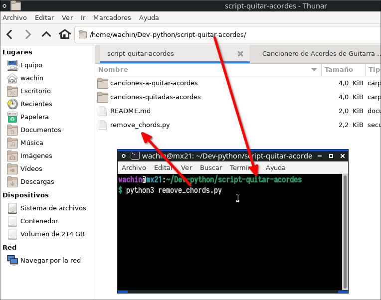

# script-quitar-acordes
Tengo muchos acordes con letras de alabanza en formato de texto en el siguiente repositorio:

[https://github.com/wachin/Cancionero](https://github.com/wachin/Cancionero)

y para hacer cancioneros solo con las letras para imprimirlos he hecho esta solución para no tener que estar quitandole linea por linea los acordes. Tal vez alguien pense y porque mejor no uso los que puedo encontrar en internet, bueno porque muchas veces esas letras tienen fallas y estas ya están correjidas.

El siguiente es un Script en Python para quitar acordes de guitarra de varios archivos de texto que estén en una carpeta.

## Requerimientos

- Python 3.x

## Uso

El programa se ejecuta desde la terminal de la siguiente manera:

```
python3 remove_chords.py
```

así como se ve en al siguiente imagen:



No tiene interfaz gráfica.

Por cierto en MX Linux hay una manera de ejecutarlo solo dando clic derecho pues MX Linux trae un lanzador para python

 El script procesará automáticamente todos los archivos de texto (.txt) en la carpeta `canciones-a-quitar-acordes` y guardará las versiones sin acordes en la carpeta `canciones-quitadas-acordes`.

## Funcionamiento detallado

El script utiliza expresiones regulares para identificar y eliminar los acordes. El patrón utilizado es:

```python
chord_pattern = r'\b[A-G](#m?|b|m|dim|aug|maj|min|sus|bm|add)?[0-9]?(/[A-G](#|b)?)?(?:\s|$)'
```

Explicación del patrón:

- `\b`: Indica el inicio de una palabra.
- `[A-G]`: Coincide con cualquier nota musical (A, B, C, D, E, F, G).
- `(#m?|b|m|dim|aug|maj|min|sus|bm|add)?`: Coincide opcionalmente con modificadores de acordes:
  - `#m?`: Sostenido, opcionalmente seguido de 'm' (menor).
  - `b`: Bemol.
  - `m`, `dim`, `aug`, `maj`, `min`, `sus`, `add`: Otros modificadores comunes.
- `[0-9]?`: Coincide opcionalmente con un número (para acordes como C7, G9, etc.).
- `(/[A-G](#|b)?)?`: Coincide opcionalmente con acordes con bajo específico (como D/F#):
  - `/`: La barra literal.
  - `[A-G]`: La nota del bajo.
  - `(#|b)?`: Sostenido o bemol opcional para la nota del bajo.
- `(?:\s|$)`: Coincide con un espacio o el final de la línea.

Este patrón permite identificar una amplia variedad de acordes, incluyendo:
- Acordes mayores y menores (C, Am)
- Acordes con sostenidos y bemoles (C#, Bb)
- Acordes con séptimas y otras extensiones (C7, Gmaj7)
- Acordes con bajo específico (D/F#)
- Otras variaciones comunes (Csus, Dadd9)

## Ejemplo

Archivo de entrada (`canciones-a-quitar-acordes/La niña de tus ojos - Daniel Calveti (B).txt`):

```
La niña de tus ojos
Daniel Calveti
B F# Abm E
B F# Abm E
VERSO I X2
B F#
Me viste a mi cuando nadie me vio
Abm E
Me amaste a mi cuando nadie me amo
...
```

Archivo de salida (`canciones-quitadas-acordes/sin_acordes_La niña de tus ojos - Daniel Calveti (B).txt`):

```
La niña de tus ojos
Daniel Calveti

VERSO I X2
Me viste a mi cuando nadie me vio
Me amaste a mi cuando nadie me amo
...
```

## Probado en

- Debian 12

## Notas adicionales

- El script mantiene la estructura de párrafos original, preservando las líneas en blanco entre secciones.
- Se eliminan completamente las líneas que solo contienen acordes.
- Los nombres de los archivos de salida tendrán el prefijo "sin_acordes_" seguido del nombre original del archivo.

---
Dios les bendiga
