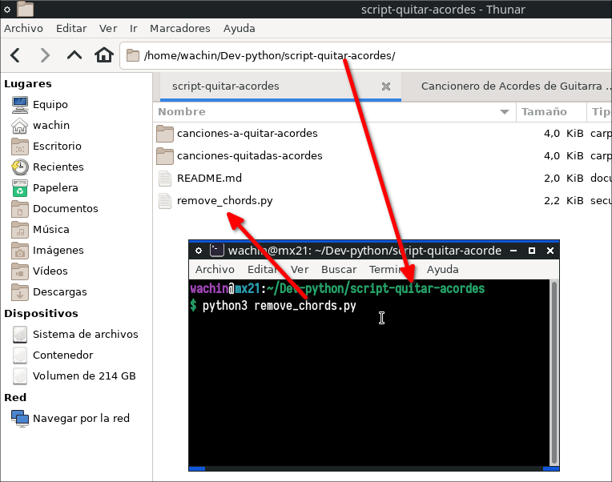

# script-quitar-acordes
Tengo muchos acordes con letras de alabanza en formato de texto en el siguiente repositorio:

[https://github.com/wachin/Cancionero](https://github.com/wachin/Cancionero)

y para hacer cancioneros solo con las letras para imprimirlos he hecho esta solución para no tener que estar quitandole linea por linea los acordes. Tal vez alguien piense y por qué mejor no uso los que puedo encontrar en internet? bueno porque muchas veces esas letras tienen fallas y estas ya están corregidas.

## Requerimientos

- Python 3.x

## Uso

El programa principal se ejecuta desde la terminal de la siguiente manera:

```
python3 remueve_acordes--Y_corchetes_a_comenratios_de_Holyrics.py
```

así como se ve en al siguiente imagen:



No tiene interfaz gráfica.

Por cierto, en MX Linux hay una manera de ejecutarlo solo dando clic derecho pues MX Linux trae un lanzador para python

 El script procesará automáticamente todos los archivos de texto (.txt) en la carpeta `canciones-a-remover-acordes` y guardará las versiones sin acordes en la carpeta `canciones-solo-letras-Holyrics`.

## Funcionamiento detallado

El script utiliza expresiones regulares para identificar y eliminar los acordes. El patrón utilizado es:

```python
CHORD_PATTERN = r'\b[A-G](#|b)?(m|maj|min|dim|aug|sus|add)?[0-9]?(?!\w)'
```

El script utiliza la lógica del programa `chord_autoscroll.py` para detectar líneas de acordes. Una línea se considera como de acordes si más del 50% de las palabras en ella coinciden con el patrón de acordes. Este enfoque evita eliminar letras del texto que coincidan con el patrón de acordes.

Explicación del patrón:

- `\b`: Indica el inicio de una palabra.
- `[A-G]`: Coincide con cualquier nota musical (A, B, C, D, E, F, G).
- `(#|b)?`: Coincide opcionalmente con sostenido (#) o bemol (b).
- `(m|maj|min|dim|aug|sus|add)?`: Coincide opcionalmente con modificadores de acordes:
  - `m`: Menor.
  - `maj`: Mayor.
  - `min`: Menor.
  - `dim`: Disminuido.
  - `aug`: Aumentado.
  - `sus`: Suspendido.
  - `add`: Añadido.
- `[0-9]?`: Coincide opcionalmente con un número (para acordes como C7, G9, etc.).
- `(?!\w)`: Asegura que después del acorde no haya un carácter de palabra (evita coincidencias parciales).

Este patrón permite identificar una amplia variedad de acordes, incluyendo:
- Acordes mayores y menores (C, Am)
- Acordes con sostenidos y bemoles (C#, Bb)
- Acordes con séptimas y otras extensiones (C7, Gmaj7)
- Otras variaciones comunes (Csus, Dadd9)

El script también convierte las etiquetas de sección entre corchetes a comentarios de Holyrics:
- `[Verso]` → `//Verso`
- `[Coro]` → `//Coro`
- `[Puente]` → `//Puente`

Esto facilita la importación de las letras en Holyrics.

## Ejemplo

Archivo de entrada (`canciones-a-remover-acordes/La niña de tus ojos - Daniel Calveti (B).txt`):

```
La niña de tus ojos
Daniel Calveti
B F# Abm E
B F# Abm E
VERSO I X2
B F#
Me viste a mi cuando nadie me vio
Abm E
Me amaste a mi cuando nadie me amo
...
```

Archivo de salida (`canciones-solo-letras-Holyrics/sin_acordes La niña de tus ojos - Daniel Calveti (B).txt`):

```
La niña de tus ojos
Daniel Calveti

VERSO I X2
Me viste a mi cuando nadie me vio
Me amaste a mi cuando nadie me amo
...
```

Otro ejemplo con etiquetas de sección:

Archivo de entrada:

```
[Verso]
G   D
Cristo nos ama
Em   C
tanto que su vida dió
G
por mi
```

Archivo de salida:

```
//Verso
Cristo nos ama
tanto que su vida dió
por mi
```

## Probado en

- Debian 12, MX Linux 23

## Notas adicionales

- El script mantiene la estructura de párrafos original, preservando las líneas en blanco entre secciones.
- Se eliminan completamente las líneas que son identificadas como líneas de acordes (más del 50% de las palabras coinciden con el patrón de acordes).
- Los nombres de los archivos de salida tendrán el prefijo "sin_acordes " seguido del nombre original del archivo.
- El script convierte las etiquetas de sección entre corchetes a comentarios de Holyrics (por ejemplo, `[Verso]` → `//Verso`).
- El script utiliza la lógica del programa `chord_autoscroll.py` para detectar líneas de acordes, lo que evita eliminar letras del texto que coincidan con el patrón de acordes.

---
Dios les bendiga
